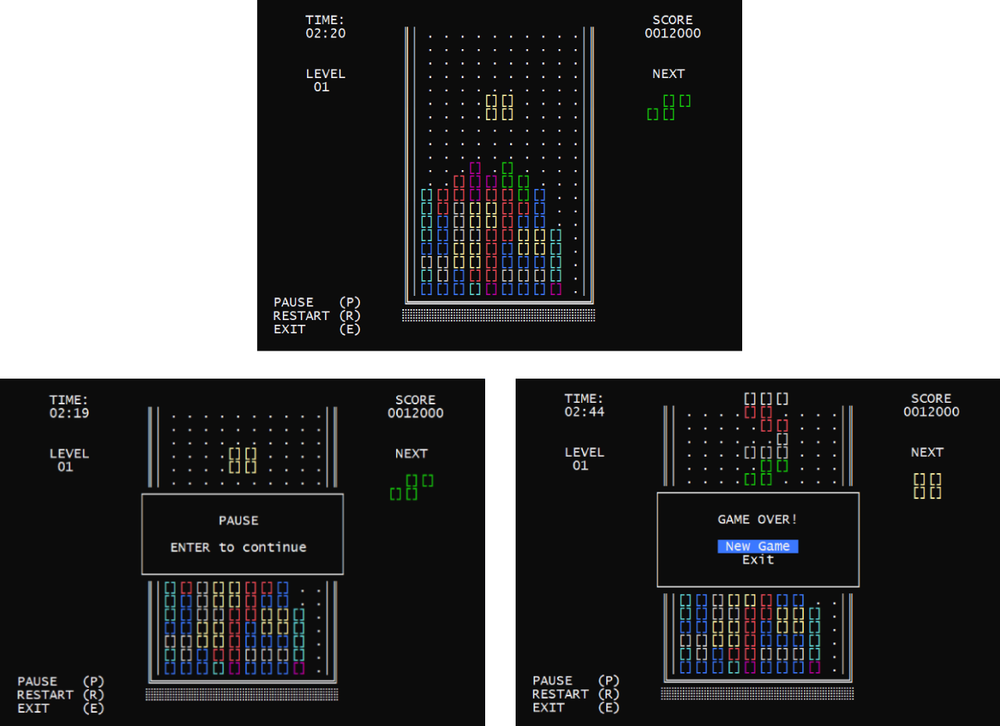

# C#nsole TETRIS

Adaptación del videojuego TETRIS, en una aplicación de consola desarrollada con .Net.

## Tecnologías usadas

- [.NET 6 (SDK v6.0.407)](https://docs.microsoft.com/es-mx/dotnet/fundamentals/)

## Getting started

1. `git clone https://github.com/HDMC3/console-tetris.git`
2. `cd console-tetris`
3. `dotnet restore`
4. `dotnet run`